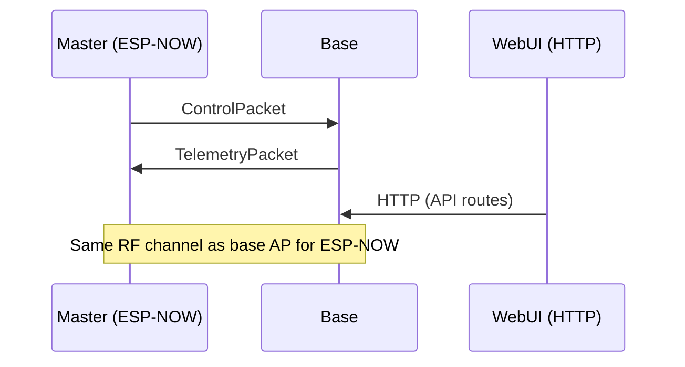
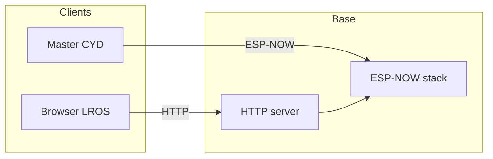

# WALL-E — System Architecture

This document describes how controllers interact, how **node health** works, how **docking** and **emotion pose** fit in, how **OTA** is used, and how **LROS**, the **master**, and **nodes** connect. For an optional repository layout proposal see [FOLDER_STRUCTURE.md](FOLDER_STRUCTURE.md).

---

## Table of contents

1. [Multi-controller philosophy](#1-multi-controller-philosophy)
2. [WebUI → Base → Nodes chain](#2-webui--base--nodes-communication-chain)
3. [Node health protocol](#3-node-health-protocol)
4. [Emotion pose library](#4-emotion-pose-library)
5. [Docking guidance](#5-docking-guidance-logic)
6. [Control and telemetry (master ↔ base)](#6-control-and-telemetry-master--base)
7. [Vision and dock protocols](#7-vision-and-dock-protocols)
8. [OTA update flow](#8-ota-update-flow)
9. [Future consolidation](#9-future-consolidation)

---

## 1. Multi-controller philosophy

### Separation of concerns

| Concern | Owner |
|---------|--------|
| Operator intent (speed, mode, E-stop, actions) | Master controller (`wall_e_master_controller`) |
| Actuation, safety timers, sensor fusion | Base (`main_wall_E_base`) |
| Charging policy, arrows, dock IR | Dock (`dock_station`) |
| Specialized processing | Audio / vision satellites |

The base **does not** embed the CYD LVGL/touch stack. The master **does not** drive GPIO to motor drivers. Boundaries are **binary protocols** (packed structs) over ESP-NOW or HTTP.

### Why ESP-NOW and Wi-Fi together

| Transport | Role |
|-----------|------|
| **ESP-NOW** | Low overhead for periodic control and small sensor frames; requires **same Wi-Fi channel** as the interface used for coordination (typically the base’s AP channel). |
| **Wi-Fi** | SoftAP for provisioning (`WALL-E-Control`), HTTP for LROS and web OTA, optional STA to home LAN. |

---

## 2. WebUI → Base → Nodes communication chain

| Path | Direction | Technology |
|------|-----------|------------|
| **LROS → Base** | Browser calls **HTTP** endpoints implemented in `main_wall_E_base/main/web_server.cpp` | REST-style handlers, JSON where implemented |
| **Master → Base** | **ESP-NOW** `ControlPacket` | Not HTTP |
| **Base → Master** | **ESP-NOW** `TelemetryPacket` | — |
| **Base ↔ Dock** | **ESP-NOW** `DockBeaconPacket_t`, `DockCommandPacket_t`, approach stage | Dock often on home Wi-Fi when `ENABLE_WIFI`; beacon includes telemetry fields |
| **Vision → Base** | **ESP-NOW** `VisionPacket_t` | Vision does not talk to the master directly |
| **Audio ↔ Base** | **ESP-NOW** (audio-specific packets / status) | See `audio_esp` and `audio_protocol.h` |

**Operational caution:** If **both** LROS and the master can command motion, conflicting drive commands are possible. The base implements **`motion_authority`** (`any` / `cyd_only` / `web_only`) in `main_wall_E_base/main/motion_authority.cpp` and exposes it via **`GET /api/motion/operator`** and **`/api/motion/authority*`** — see [main_wall_E_base/README.md](main_wall_E_base/README.md).

---

## 3. Node health protocol

### Message format

- **Magic:** ASCII `WNHT` → `0x574E4854`
- **Version:** `1` (`WALLE_NODE_HEALTH_VERSION`)
- **Struct:** `WalleNodeHealthPacket_t` — packed fields: `node_id`, `role`, `battery_pct`, `temp_c`, `uptime_ms`, `last_error`, `flags`

Canonical definition: [main_wall_E_base/main/node_health_protocol.h](main_wall_E_base/main/node_health_protocol.h) — **identical copies** exist under other folders; treat any drift as a bug.

### Node IDs

| Value | Constant |
|-------|----------|
| 0 | `WALLE_NODE_BASE` |
| 1 | `WALLE_NODE_MASTER` |
| 2 | `WALLE_NODE_AUDIO` |
| 3 | `WALLE_NODE_DOCK` |
| 4 | `WALLE_NODE_VISION` |

### Timing and transport

- **Not a hard real-time bus.** Nodes emit health when their firmware schedules it (e.g. dock ESP-NOW path shares airtime with **dock beacon** at **10 Hz** (`ESPNOW_BEACON_INTERVAL_MS` = 100 ms in `dock_config.h`) when Wi-Fi is enabled).
- **Consumers** (e.g. base `node_health_registry`) typically record **last_seen_ms** and infer **offline** if no packet arrives for an application-specific timeout (implementations vary — check `node_health_registry.cpp`).

### Failure modes (conceptual)

| Symptom | Likely causes |
|---------|----------------|
| No health from a node | Wrong Wi-Fi channel, node off, ESP-NOW not initialized, or filtered MAC |
| Stale `uptime_ms` | Node reset or packet not updating |
| `WALLE_NODE_HEALTH_UNKNOWN_BAT` | Node has no battery sense (e.g. dock may report unknown for its own “battery” field) |
| Flags stuck | Fault not cleared, or registry not updated |

---

## 4. Emotion pose library

**Location:** [`lib/walle_emotion_pose/`](lib/README.md)

**Intent:** Separate **emotional state** and **pose intent** from concrete servo PWM. The base applies hardware through existing servo drivers; the master may mirror or preview state.

**Structure:** C++ module with `library.json` under `lib/`; optional thin wrappers in base and master (some builds exclude duplicate `.cpp` via `build_src_filter` — see `main_wall_E_base/platformio.ini`).

---

## 5. Docking guidance logic

End-to-end docking is **layered**; do not conflate unrelated sensors.

| Layer | Mechanism |
|-------|-----------|
| **Search / homing** | Dock `DockBeaconPacket_t` at ~10 Hz; base uses RSSI and `dock_id`. |
| **IR alignment** | Base **two IR transmitters** (~38 kHz); dock **two receivers** → **`ir_align_hint`** on the beacon. |
| **Approach stage** | WALL-E sends `DOCK_CMD_APPROACH_STAGE`; dock uses **timeout** to fall back to local IR sensors. |
| **Presence** | VL6180 ToF band, optional **break-beam** (`PIN_IR_BEAM`), obstacle inputs — see `dock_config.h`. |
| **Charge** | ACS712 thresholds + MOSFET gate + state machine (`STATE_*` in dock state module). |

**Documentation rule:** **Alignment IR** (side receivers) and **break-beam** (slot beam) are **different** inputs in firmware.

---

## 6. Control and telemetry (master ↔ base)

Defined in [wall_e_master_controller/protocol.h](wall_e_master_controller/protocol.h).

- **ControlPacket:** `leftSpeed`, `rightSpeed`, `driveMode`, `behaviourMode`, `action`, `systemFlags`, `servoTargets[]`
- **TelemetryPacket:** Battery, current, temperature, mood, autonomy-related fields (see struct for full list)

Both are **packed** for ESP-NOW.

---

## 7. Vision and dock protocols

| Protocol | Magic | Notes |
|----------|-------|--------|
| Vision | `VISION_MAGIC` (`0x5649534E`) | `VisionPacket_t` in `vision_node/include/vision_protocol.h` |
| Dock beacon | `DOCK_BEACON_MAGIC` | `DockBeaconPacket_t` includes `ir_align_hint` — [dock_station/dock_protocol.h](dock_station/dock_protocol.h) |

Keep **byte-compatible** copies under `main_wall_E_base/main/dock_protocol.h` when structs change.

---

## 8. OTA update flow

1. **Build** with PlatformIO → `firmware.bin` under `.pio/build/<env>/`.
2. **Base:** Web upload at `http://192.168.4.1/update` (AP) and/or ArduinoOTA port **3232**.
3. **Controller / dock:** `upload_protocol = espota` with correct IP (see [OTA_README.md](OTA_README.md)).
4. **Batch:** `ota_build_all.ps1` / `ota_build_all.sh`.

mDNS names (`wall-e-base.local`, etc.) depend on LAN multicast support.

---

## 9. Future consolidation

- One **`protocols/`** directory included by all firmware projects
- Optional protocol **version field** on every packet for mixed-firmware fleets
- Documented **channel + MAC** setup script for labs
