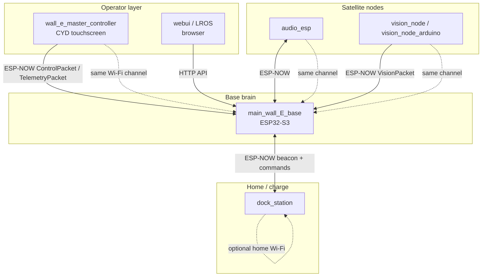

# WALL-E Multi-Node Robotics Platform

[](https://github.com/sumkindafreak/wall-e)
[](https://www.espressif.com/)

Distributed firmware for a life-size **WALL-E**-style robot: multiple **ESP32** nodes, a **browser operator UI (LROS)**, shared libraries, and coordination over **Wi-Fi**, **ESP-NOW**, **OTA**, and a **node health** heartbeat.

**Repository:** [github.com/sumkindafreak/wall-e](https://github.com/sumkindafreak/wall-e)

---

## Table of contents

1. [Goals](#high-level-goals)
2. [Architecture](#architecture)
3. [Nodes at a glance](#nodes-at-a-glance)
4. [Communication](#communication-stack)
5. [Hardware overview](#hardware-overview)
6. [Setup](#setup)
7. [Development workflow](#development-workflow)
8. [Media](#media-placeholders)
9. [Roadmap](#roadmap)
10. [Documentation index](#documentation-index)

---

## High-level goals

| Goal | How the repo supports it |
|------|---------------------------|
| **Separation of concerns** | No single MCU runs UI, motors, audio, vision, and charging logic together. |
| **Low-latency control** | Master ↔ base uses **ESP-NOW** with packed structs; same RF channel as the base AP. |
| **Observability** | **Node health** (`WNHT`) and dock **beacon** packets expose state to the base and UI. |
| **Safe docking** | Dock station manages charge current, presence sensing, and **IR alignment** hints. |
| **Operator flexibility** | Physical **CYD master**, optional **LROS** in a browser, both ultimately commanding the **base**. |

---

## Architecture

### Diagram (Mermaid)

> Renders on GitHub; for plain text see the ASCII block below.



### Diagram (ASCII)

```
  ┌─────────────────────┐         ┌─────────────────────┐
  │ Master controller   │         │ Web UI (LROS)       │
  │ (ESP32 + touch)     │         │ Browser → HTTP      │
  └──────────┬──────────┘         └──────────┬──────────┘
             │ ESP-NOW                      │ HTTP
             │ Control / Telemetry           │
             ▼                               ▼
  ┌──────────────────────────────────────────────────────┐
  │ main_wall_E_base — Base brain (ESP32-S3)              │
  │ Motors · servos · AP · web server · ESP-NOW hub       │
  └─┬──────────────┬──────────────┬──────────────────────┘
    │              │              │
    │ ESP-NOW      │ ESP-NOW      │ ESP-NOW
    ▼              ▼              ▼
┌────────┐   ┌──────────┐   ┌─────────────┐
│ audio  │   │ vision   │   │ dock_station │
│ _esp   │   │ _node     │   │ charge + IR  │
└────────┘   └──────────┘   └─────────────┘
```

---

## Nodes at a glance

| Node | Folder | Responsibility |
|------|--------|------------------|
| **Master controller** | `wall_e_master_controller/` | Touch UI, `ControlPacket` TX, `TelemetryPacket` RX. |
| **Base (locomotion)** | `main_wall_E_base/` | Motors, servos, Wi-Fi AP, HTTP, ESP-NOW RX/TX, docking FSM, node health registry. |
| **Audio** | `audio_esp/` | Audio / DFPlayer path; ESP-NOW side channel to base. |
| **Vision** | `vision_node/` or `vision_node_arduino/` | Camera + motion; `VisionPacket_t` to base. |
| **Dock** | `dock_station/` | Charging, sensors, IR alignment receivers, dock beacon + `ir_align_hint`. |
| **Web UI** | `webui/` | Static LROS assets; talks to **base** over HTTP (not ESP-NOW). |

Per-folder details: [wall_e_master_controller/README.md](wall_e_master_controller/README.md) · [main_wall_E_base/README.md](main_wall_E_base/README.md) · [audio_esp/README.md](audio_esp/README.md) · [vision_node/README.md](vision_node/README.md) · [dock_station/README.md](dock_station/README.md) · [webui/README.md](webui/README.md) · [lib/README.md](lib/README.md)

---

## Communication stack

| Layer | Mechanism | Typical use |
|-------|-----------|-------------|
| **Operator → base (real-time)** | ESP-NOW | `ControlPacket` / `TelemetryPacket` ([protocol.h](wall_e_master_controller/protocol.h)). |
| **Browser → base** | HTTP on LAN or AP | LROS fetches JSON or forms; see `web_server.cpp` on base. |
| **Vision / audio ↔ base** | ESP-NOW | Magic + length dispatch in base receiver. |
| **Base ↔ dock** | ESP-NOW | `DockBeaconPacket_t` (~10 Hz when Wi-Fi enabled on dock), dock commands. |
| **Heartbeat** | ESP-NOW | `WalleNodeHealthPacket_t` — magic `WNHT`, versioned struct ([node_health_protocol.h](main_wall_E_base/main/node_health_protocol.h)). |
| **Provisioning / OTA** | Wi-Fi STA/AP | Base AP `WALL-E-Control`; OTA [OTA_README.md](OTA_README.md). |

**Critical:** ESP-NOW peers must use the **same Wi-Fi channel** as the base access point (see [ARCHITECTURE.md](ARCHITECTURE.md)).

---

## Hardware overview

| Role | MCU (typical) | Notes |
|------|----------------|-------|
| Master | ESP32 (e.g. CYD 2432S028) | TFT + touch; no motors. |
| Base | ESP32-S3 | Tank drive, servos (I2C PWM), VL53L1X, obstacle bumpers; no modulated **IR TX** toward the dock in firmware. |
| Audio | ESP32-S3 | DFPlayer or project-specific audio chain. |
| Vision | ESP32-S3 + PSRAM | OV2640; pin map is board-specific. |
| Dock | ESP32-S3 | Charge MOSFET, ACS712, VL6180 I2C, TSOP IR receivers, NeoPixel, TFT. |

**Dock alignment:** WALL-E emits **modulated IR** from two LEDs; the dock’s two receivers drive **`ir_align_hint`** on the beacon; the base **ALIGN** state uses that over ESP-NOW.

**Pins:** Authoritative maps live in each project’s `*_config.h`. README tables are summaries only.

---

## Setup

### Prerequisites

- [PlatformIO](https://platformio.org/) (recommended) **or** Arduino IDE 2.x + ESP32 board support.
- USB cable per module; serial **115200** baud unless a README says otherwise.

### Clone and build

```bash
git clone https://github.com/sumkindafreak/wall-e.git
cd wall-e
```

Examples:

```bash
cd main_wall_E_base && pio run -e wall_e_brain_s3
cd ../wall_e_master_controller && pio run -e cyd_esp32_2432s028
cd ../dock_station && pio run -e dock_esp32
```

Shared Arduino libraries: [`lib/`](lib/README.md) — referenced via `lib_extra_dirs` in PlatformIO.

### OTA

See **[OTA_README.md](OTA_README.md)** — web update URL for the base, `espota`, and `ota_build_all` scripts.

### RF / MAC / channel

- After flashing, each ESP32 has a factory **Wi-Fi MAC**; any stored peer list may need refresh.
- Align **Wi-Fi channel** with the base AP for ESP-NOW (document your router/AP channel if nodes use STA).
- **Dock ID:** `DOCK_ID` in `dock_config.h` — set uniquely if multiple docks exist.

---

## Development workflow

1. **Pick a node** — Build only what you change (`pio run -e <env>`).
2. **Keep protocols in sync** — `dock_protocol.h` and `node_health_protocol.h` are duplicated in several trees until consolidated; change all copies or document follow-up.
3. **Test on hardware** — Note board variant (DevKit, CYD, etc.) in PRs.
4. **Document** — Update the module `README.md` when pins, env names, or protocols change.

More detail: [CONTRIBUTING.md](CONTRIBUTING.md).

---

## Media placeholders

| Slot | Suggested path |
|------|----------------|
| Hero build photo | `docs/media/hero.jpg` |
| Master UI | `docs/media/controller.jpg` |
| Dock + robot | `docs/media/dock.jpg` |
| Demo GIF | `docs/media/demo.gif` |

Create `docs/media/` when you add assets, or host externally and link here.

---

## Roadmap

| Item | Notes |
|------|--------|
| Single **`protocols/`** include tree | Remove duplicate headers; CI compile check. |
| Vision channel sync guide | One doc for “set router channel = base channel”. |
| LROS ↔ base WebSocket (optional) | Lower latency than polling for some panels. |
| CI matrix | Build `main_wall_E_base`, `dock_station`, `wall_e_master_controller` on push. |
| SPDX license file | Clarify redistribution terms. |

---

## Documentation index

| Document | Content |
|----------|---------|
| [ARCHITECTURE.md](ARCHITECTURE.md) | Design philosophy, protocols, docking, OTA, WebUI chain. |
| [CONTRIBUTING.md](CONTRIBUTING.md) | Branches, commits, conventions, new nodes, LROS. |
| [FOLDER_STRUCTURE.md](FOLDER_STRUCTURE.md) | Optional repo reorganization (no code moves yet). |
| [REPO_AUDIT.md](REPO_AUDIT.md) | Gaps, naming, refactors to consider. |
| [OTA_README.md](OTA_README.md) | Over-the-air updates. |

---

## License

Add a `LICENSE` file to the repository root when you choose a license (MIT, Apache-2.0, etc.). Until then, treat usage as **all rights reserved** unless you state otherwise.
